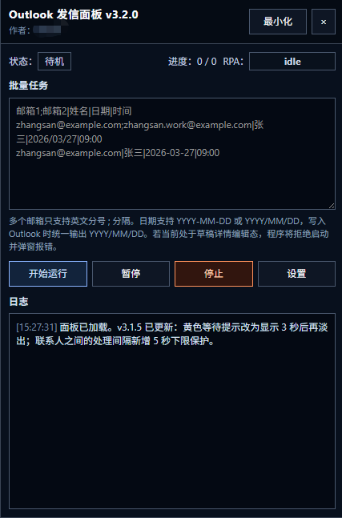
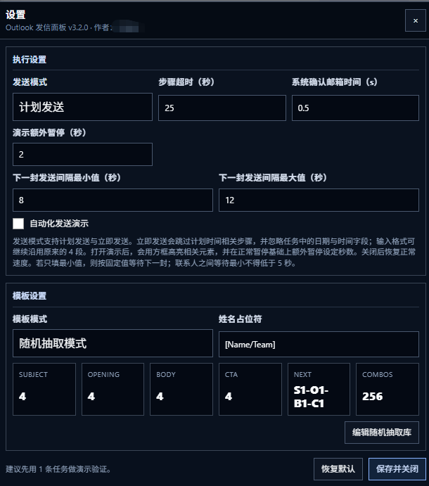
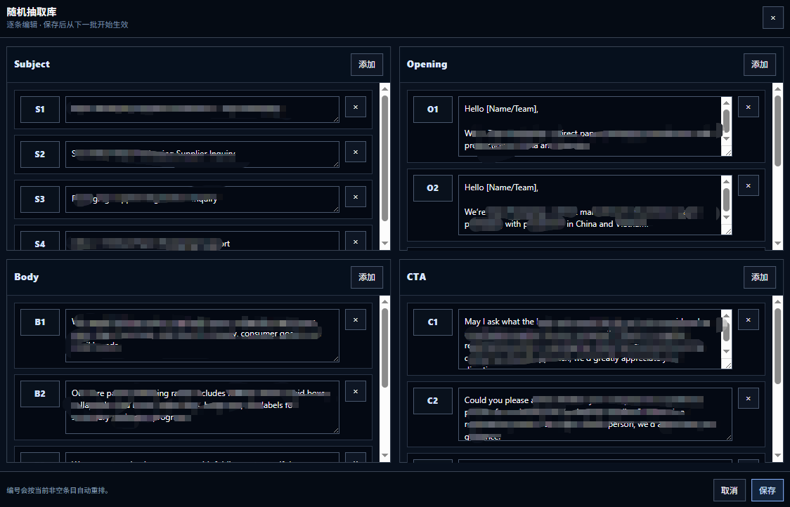

# Outlook Schedule Panel

一个面向 **Outlook Web** 的定时发信辅助面板，用于批量录入任务、自动填写邮件内容、设置计划发送时间，并提供日志追踪、状态提示与演示高亮能力。

## 项目简介

本项目以浏览器注入脚本的形式运行，在 Outlook 网页端提供一个独立操作面板，用于提升重复性邮件发送任务的处理效率。

面板支持批量任务输入、单模板模式、随机抽取模板模式、运行日志记录、RPA 状态识别以及演示模式，可用于半自动邮件发送、流程演示与稳定化操作场景。

## 适用场景

- 批量整理并定时发送邮件任务
- 在 Outlook Web 中进行重复性邮件录入操作
- 需要保留原有签名并规范插入正文内容的场景
- 需要面向人工或 RPA 展示可视化执行流程的场景
- 需要记录发送过程、状态与错误信息的场景





## 核心功能

### 1. 批量任务输入

支持按行录入任务，单行格式如下：

```text
邮箱1;邮箱2|姓名|日期|时间
```

示例：

```text
zhangsan@example.com;zhangsan.work@example.com|张三|2026/03/27|09:00
zhangsan@example.com|张三|2026-03-27|09:00
```

功能特点：
- 支持多个收件邮箱，使用英文分号 `;` 分隔
- 日期输入同时支持 `YYYY-MM-DD` 与 `YYYY/MM/DD`
- 写入 Outlook 时统一输出为 `YYYY/MM/DD`
- 对邮箱、日期、时间格式进行校验，并在异常时中止运行

### 2. 单模板模式

在单模板模式下，所有任务统一使用同一套主题与正文模板。

支持姓名占位符替换，可根据任务中的联系人姓名动态生成邮件内容。

### 3. 随机抽取模式

在随机抽取模式下，邮件内容由以下四类内容组合生成：

- Subject
- Opening
- Body
- CTA

每类内容可分别维护多条候选项，系统会按预排固定序列组合，尽量保证：

- 整体变化尽量多
- 与上一封邮件差异尽量大

当前批次启动后会锁定当次模板配置，运行中修改模板内容不会影响正在执行的任务，仅从下一批开始生效。

### 4. 正文插入与签名保留

邮件正文会从正文首行插入，并保留 Outlook 自动签名。

正文处理规则包括：
- 称呼行后固定保留 1 个空行
- 仅对正文首段首行添加缩进
- 保持正文主体结构稳定
- 不破坏后续段落与签名区域

### 5. 运行状态与日志追踪

面板提供完整的运行状态与日志输出，便于人工观察和问题定位。

可展示内容包括：
- 当前状态
- 当前进度
- RPA 状态
- 当前任务对象
- 当前任务时间
- 当前使用的模板组合编号
- 步骤执行日志
- 成功 / 警告 / 错误信息

随机抽取模式下，日志中会记录当前邮件使用的模板组合编号，例如：

```text
S2-O4-B1-C3
```

### 6. 演示模式

演示模式开启后，脚本会在执行关键步骤时对页面目标区域进行高亮，并在原有等待基础上增加额外暂停时间，便于：

- 人工观察执行过程
- 演示自动化操作流程
- 辅助录屏或项目展示

### 7. 安全启动校验

运行前会检测当前 Outlook 页面状态。

若当前处于以下不安全状态，脚本会拒绝启动：
- 草稿详情编辑态
- 非空写信界面
- 异常弹窗残留
- 非可安全启动的主界面

该机制用于降低误操作风险，避免在错误页面状态下继续执行任务。

### 8. 联系人间隔保护

两位联系人之间的处理间隔设有下限保护。

即使设置中的最小等待时间低于 5 秒，运行时仍会按 **5 秒** 的最小间隔执行。

## 界面组成

主面板包含以下核心区域：

- 状态显示
- 进度显示
- RPA 状态标识
- 批量任务输入区
- 开始 / 暂停 / 停止控制区
- 日志输出区
- 设置入口

设置界面包含以下内容：

- 步骤超时设置
- 系统确认邮箱时间设置
- 演示额外暂停时间设置
- 下一封发送间隔设置
- 模板模式切换
- 姓名占位符设置
- 单模板内容设置
- 随机抽取库编辑器入口

随机抽取库编辑器支持分别维护：

- Subject
- Opening
- Body
- CTA

并支持逐条增删、保存与取消操作。

## 使用方式

### 1. 打开 Outlook Web

在浏览器中进入 Outlook 网页端，并确保页面处于可安全启动的主界面。

### 2. 注入脚本

将脚本内容注入当前页面运行。

### 3. 填写任务

在面板中按指定格式录入批量任务。

### 4. 配置参数

根据需要设置：
- 执行超时
- 发送间隔
- 模板模式
- 演示模式
- 模板内容

### 5. 开始运行

点击“开始运行”后，脚本将依次处理任务：

- 新建邮件
- 写入收件人
- 写入主题
- 写入正文
- 打开发送菜单
- 选择计划发送
- 设置自定义日期与时间
- 完成发送

## 注意事项

- 本项目面向 **Outlook Web** 页面环境设计
- 使用前应先通过少量任务进行验证
- 任务格式错误会触发校验并停止运行
- 当前批次运行中修改模板，不会影响已启动批次
- 演示模式会主动拉长执行时间
- 本项目为页面注入式辅助工具，页面结构变化可能影响部分定位逻辑

## 项目特点

- 面板化操作，界面集中
- 支持批量任务录入
- 支持单模板与随机抽取双模式
- 自动保留签名并规范正文格式
- 提供运行日志与错误代码
- 支持演示高亮与状态可视化
- 具备安全启动校验与等待下限保护

